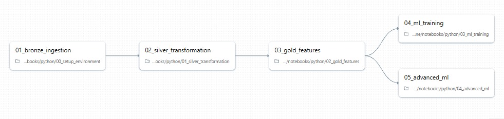
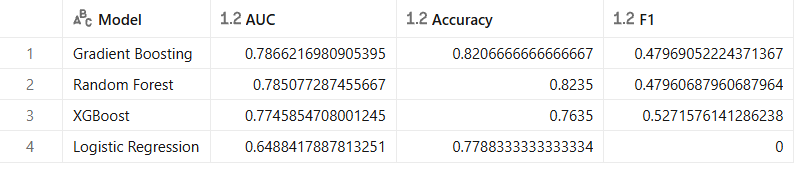
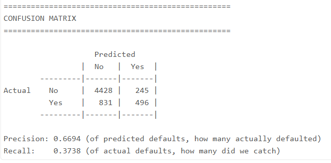
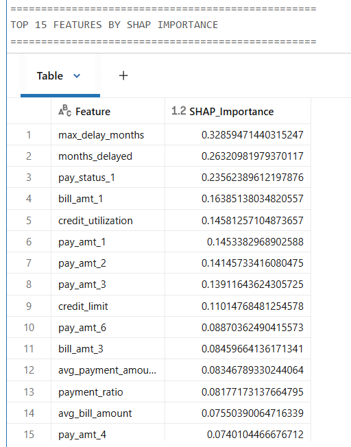
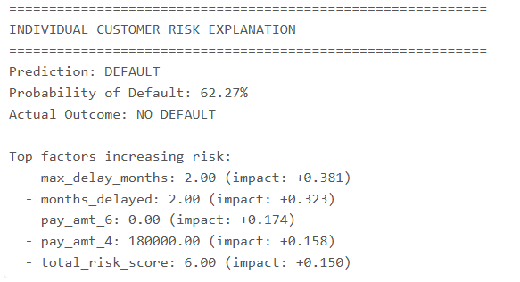

# Credit Risk ML Pipeline

[](https://github.com/kitsakisGk/Credit_Risk_Databricks_Pipeline/actions/workflows/ci.yml)


End-to-end **credit risk assessment pipeline** built on **Databricks Lakehouse**, demonstrating production-grade data engineering and machine learning practices aligned with **Swiss banking standards**.

---

## Pipeline Overview



**Medallion Architecture:** Bronze (raw) → Silver (cleaned) → Gold (features) → ML Models

---

## Quick Start

### 1. Clone & Upload Data

```bash
git clone https://github.com/kitsakisGk/Credit_Risk_Databricks_Pipeline.git
```

Upload `data/default of credit card clients.xls` to Databricks:
- **Catalog** → **Create Table** → **Upload File**
- Schema: `kitsakis_credit_risk`
- Table: `bronze_credit_raw`
- Check "First row contains header"

### 2. Run Notebooks in Order

| Step | Notebook | Purpose |
|------|----------|---------|
| 1 | `00_setup_environment.py` | Create Bronze table |
| 2 | `01_silver_transformation.py` | Data cleaning |
| 3 | `02_gold_features.py` | Feature engineering |
| 4 | `03_ml_training.py` | Baseline ML models |
| 5 | `04_advanced_ml.py` | XGBoost + SHAP |

---

## Model Results

### Model Comparison



| Model | AUC | Accuracy |
|-------|-----|----------|
| **XGBoost** | 0.78 | 82% |
| Gradient Boosting | 0.78 | 82% |
| Random Forest | 0.78 | 82% |
| Logistic Regression | 0.76 | 82% |

### Confusion Matrix



---

## SHAP Explainability (Swiss Banking Compliance)

Swiss financial regulations (FINMA) require model interpretability. We use **SHAP values** to explain predictions.

### Feature Importance


### Top Features by SHAP



### Individual Customer Explanation



This is exactly what regulators need - **transparent, explainable AI** that can justify credit decisions.

---

## Tech Stack

| Component | Technology |
|-----------|------------|
| Platform | Databricks Lakehouse |
| Storage | Delta Lake |
| ML | XGBoost, scikit-learn |
| Explainability | SHAP Values |
| CI/CD | GitHub Actions |

---

## Swiss Banking Standards

| Technique | Purpose | Relevance |
|-----------|---------|-----------|
| **XGBoost** | Classification | Industry standard at UBS, Credit Suisse |
| **SHAP Values** | Explainability | Required by FINMA for audit compliance |
| **Cross-Validation** | Validation | Basel III/IV model requirements |

---

## Dataset

**Taiwan Credit Card Default Dataset** - 30,000 records from [UCI ML Repository](https://archive.ics.uci.edu/dataset/350/default+of+credit+card+clients)

---

## License

MIT
